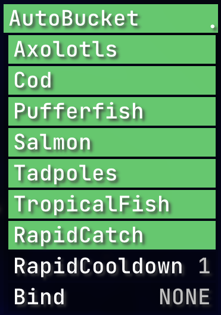

    

  <h1>AutoBucket</h1>
  
A Rusherhacks Plugin to automatically capture aquatic mobs.

  
  

## Features:

- Automatically captures nearby aquatic mobs with a water bucket
- Configurable settings for targeting specific mob types:
  - Axolotls
  - Cod
  - Pufferfish
  - Salmon
  - Tadpoles
  - Tropical Fish
- Cooldown system to prevent rapid capturing

## Module Settings:

    

## How to Use:

- Ensure you have water buckets in your inventory, hotbar, or main hand.
- Move within a 5-block radius of the target aquatic mobs.
- The plugin will automatically use the water buckets to capture the mobs based on your configured settings.

## Contributing:

Contributions are welcome! Please see the [CONTRIBUTING.md](CONTRIBUTING.md) file for guidelines on how to contribute to this project.
